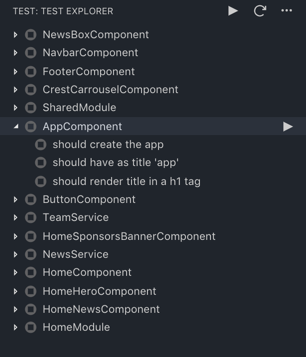

# Angular/Karma Test Explorer for Visual Studio Code

This repository contains the implementation for `Angular/Karma Test Explorer` extension that works with the
[Test Explorer UI](https://marketplace.visualstudio.com/items?itemName=hbenl.vscode-test-explorer) extension.

## Development

- install the [Test Explorer UI](https://marketplace.visualstudio.com/items?itemName=hbenl.vscode-test-explorer) extension
- fork and clone this repository and open it in VS Code
- run `npm install`
- run `npm run watch` or start the watch Task in VS Code
- start the debugger (F5)

You should now see a second VS Code window, the Extension Development Host.
Open a angular or karma project in this window and click the "Test" icon in the Activity bar.
Now you should see the test suite in the side panel (angular projects take longer to load do to angular build times):

# Making Changes

- pick an existing bug or feature from the repository (or create your own).
- create a new branch with a descriptive name, I suggest a prefix like feature/my-new-feature or bugfix/this-damm-bug.
- make the code changes.
- create a pull request on the repository, please link the pull request to the feature or bug related to your changes.
- include a summary of the changes you made in the pull request.

# Extra Guidelines

- please include unit tests (I am using jest) for any new functionality you submit.
- if it's a bugfix and tests exist for that module make sure the changes dont break them or that the bug is now covered by test cases.
- make sure you have installed prettier and tslint and that all the code submitted is properly formatted.

# Most important:  

Dont be shy, comment on the issue at hand so the community and I can give you a hand.
If there is something you dont understand please ask, I am more than willing to answer any questions.

## Finally thanks for contributing to this project it means a lot to me and all the people using this extension.

