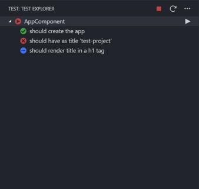

# Angular/Karma Test Explorer for Visual Studio Code

The `Angular/Karma Test Explorer` extension allows you to run or debug your Angular or Karma tests with the
[Test Explorer UI](https://marketplace.visualstudio.com/items?itemName=hbenl.vscode-test-explorer) extension on Visual Studio Code.

## Features

- See all angular tests in the side bar without running them.
- Reload tests manually by the reload button in the UI.
- Run all tests together, run set of tests, run single test and see results in the UI.
- Shows a failed test's log when the test is selected in the explorer.
- Supports Angular CLI projects.
- Supports standalone karma (specify "Karma" as projectType).
- Supports non CLI Angular projects (specify "Angular" as projectType).
- Supports multi-root workspaces(only one angular app per workspace).
- Adds CodeLenses to your test files for starting and debugging tests.
- Adds Gutter decorations to your test files showing the tests' state.
- Adds line decorations to the source line where a test failed.
- Loads values from user karma.conf.js (some get removed to make the explorer work correctly).
- Detects configuration changes and reload tests automatically.
- Allows configuration for different type of workflows: Angular project path, project type, karma.conf path, default project name for multiple projects inside one root.
- Forwards the console output from Karma to a VS Code output channel(Test Explorer Logs).

## Getting started

- Install the extension.
- Restart VS Code and open the Test view.
- Run your tests using the  icon.
- If a test failed click on it and you will see the fail information on vscode `Test Explorer` output channel.

## Planned features

- Debug tests.
- Cancel current run.
- Block during test execution.
- Support Ionic projects.
- Support multiple angular apps per workspace.
- Detect file changes(workspace, test definitions) and reload tests automatically.
- Lets you choose test suites or individual tests in the explorer that should be run automatically after each file change.

## Configuration

List of currently used properties:

| Property                                               | Description                                                                                                                                    |
| ------------------------------------------------------ | ---------------------------------------------------------------------------------------------------------------------------------------------- |
| `angularKarmaTestExplorer.defaultAngularProjectName`   | (Only for AngularCLI projects) Set the default angular project to be tested, if this is is null default project in angular.json will be loaded |
| `angularKarmaTestExplorer.defaultSocketConnectionPort` | This is the port that will be used to connect Karma with the test explorer                                                                     |
| `angularKarmaTestExplorer.debugMode`                   | This will enable debug mode, which will create a new output channel with detailed logs                                                         |
| `angularKarmaTestExplorer.projectRootPath`             | The working directory where the project is located (relative to the root folder)                                                               |
| `angularKarmaTestExplorer.karmaConfFilePath`           | The path where the karma.conf.js is located (relative to the angular project folder)                                                           |
| `angularKarmaTestExplorer.projectType`                 | Setup the type of project you re using('AngularCLI', 'Angular' or 'Karma'). Default value is AngularCLI                                        |

## Disclaimer

If you find a bug or think that a feature is missing and is not in the backlog please report it.
If you wanna help out please read the [contribution guidelines for this project](.github/CONTRIBUTING.md).

### VERSION/UPDATE PROBLEM

If you were using 1.0.3 version I made some mistakes in the publishing process and I had to republish the extension.
If you re on this version and not getting updates please uninstall the extension and install it again to the latest preview release version (0.X.X)
